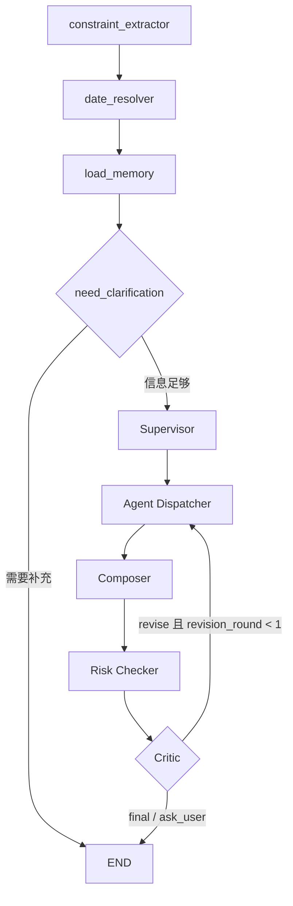

# LifeOps Agent Graph

## 根图

FastAPI 和前端继续使用稳定入口 `run_lifeops(...)`。默认 `LIFEOPS_AGENT_MODE=multi_agent` 时，根图如下：



根图保留原节点对外名称：`planner`、`execute_plan`、`synthesize_plan`、`risk_checker`、`reflection`。因此已有 trace、SSE 事件和前端节点展示不需要重写。

## Supervisor

Supervisor 输入：

- `user_input`
- `constraints`
- `intent_contract`
- `previous_intent_contract`
- `memory_resolution`

输出由 `SupervisorDecision` 校验，包含主任务类型、策略和 1 至 4 个 `AgentTask`。校验项包括：

- `task_id` 唯一；
- 意图合同要求的 Specialist 不得缺失；
- 主任务类型不得被 LLM 随意改写；
- 依赖必须引用已存在任务；
- 任务依赖不能形成环。

LLM 未启用、Schema 非法、校验失败或调用异常时，系统使用规则 Supervisor 生成等价委派，并在 `planner_meta` 中记录来源、模型、回退原因和校验错误。

## Specialist 子图

每个 Specialist 都运行相同生命周期的独立 LangGraph 子图：

```text
prepare -> execute_tools -> build_proposal -> END
```

`prepare` 深拷贝根 `AgentState`，把任务类型限制为当前领域，并清空候选、工具结果和最终计划。子图只把结构化 `AgentProposal` 与 `AgentRunRecord` 返回根图，不直接覆盖其他 Agent 状态。

| Agent | 工具白名单 | 主要输出 |
|---|---|---|
| Travel | weather, place_search, search, route, budget | itinerary, route, budget |
| Meal | place_search, meal_pick, route, budget, confirm_action | meal_candidates, itinerary, budget |
| Errand | place_search, errand_parse, route, budget, confirm_action | errand_items, itinerary, route |
| Todo | todo_decompose, confirm_action | todo_items, time_blocks, acceptance_criteria |

Provider 使用 mock 或发生降级时，Agent 状态记为 `degraded`，警告写入 `agent_runs[].warnings`，而不是假装调用成功。

## Composer

单 Agent 时直接采用其 `plan_fragment`。多 Agent 时 Composer：

1. 合并地点、餐饮、跑腿、待办和确认动作；
2. 对地点和动作去重；
3. 重新计算跨 Agent 路线；
4. 重新估算并约束总预算；
5. 生成混合任务时间线；
6. 把 Agent Contract、运行记录和记忆解析元数据附加到最终计划。

## Critic 与定向修订

Risk Checker 先生成风险信息，Critic 再将反思结果转换为 `CriticDecision`：

- `final`：直接返回；
- `ask_user`：需要用户决策；
- `revise`：按问题关键词映射到 Travel / Meal / Errand / Todo。

修订时 Dispatcher 保留未命中的 Agent Proposal，只删除并重跑 `revision_targets` 指定的 Agent。`revision_round` 最大为 1，防止循环和不可控延迟。

## 多轮上下文与记忆

- `previous_result.constraints` 恢复上一轮硬约束；
- `previous_intent_contract` 保留上一轮子任务；
- 明确任务切换可替换旧任务，否则追加或修改原计划；
- `memory_overrides` 记录本轮禁用/新增的偏好，避免用户说“不要咖啡”后又被长期画像重新注入；
- SQLite 用户画像只作为默认偏好，不覆盖本轮明确输入。

## 可观测性

- 根节点 trace：输入/输出快照、耗时、异常；
- Agent SSE：`agent_started`、`agent_completed`、`task_id`、`agent_name`、`revision_round`；
- API 元数据：`planner_meta`、`agent_tasks`、`agent_runs`、`memory_resolution`、`critic`；
- 前端详情页：展示委派、工具、状态、耗时、警告和修订结果。

## Legacy 回滚

设置以下变量可回到原单图实现：

```env
LIFEOPS_AGENT_MODE=legacy
```

两种模式共用 `run_lifeops(...)` 响应合同，便于灰度、回归和故障回滚。
